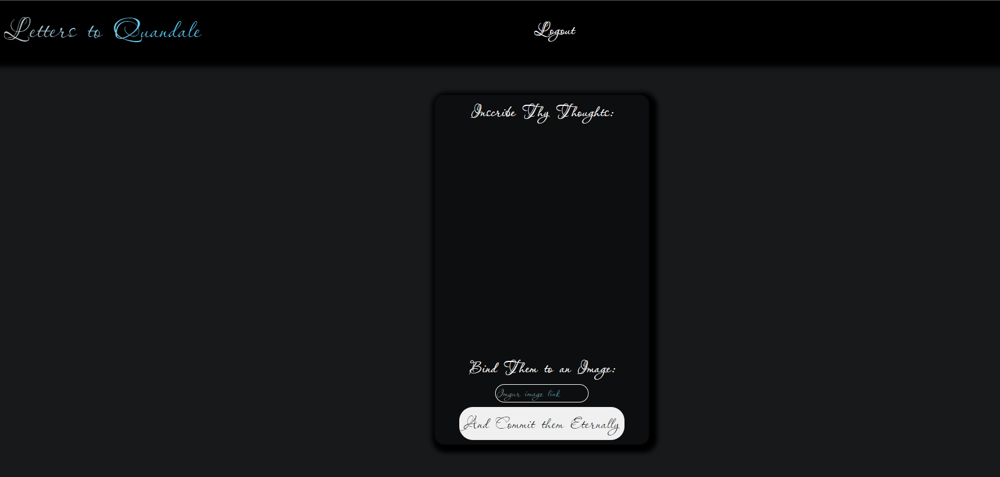

# Letters to Quandale

## Description
Our app uses the MERN stack to allow users to Signup/Login/Logout, enter a journal entry and associat that entry with a picture, and to later check their profile to reference any of their past entries. 

## Technologies Used
Our app uses the basic MERN stack, with some styling done in google fonts. We make use of the apollo express server in order to utilize queries and mutations on our database.

## Screenshot 

## Deployment
Github:https://github.com/Mersant/letters-to-quandale  
Heroku: https://dashboard.heroku.com/apps/todd-howard-simulator